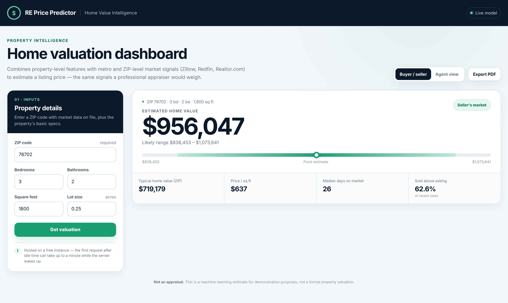

# RE Price Predictor

Machine-learning home valuation that combines **what a property is** (beds, baths, size, lot) with **what the market around it is doing** (Zillow, Redfin and Realtor.com signals), the way an appraiser weighs both.

**[Live demo](https://re-price-predictor.onrender.com)** · **[Notebooks repo](https://github.com/mikeo24/re-price-predictor-notebooks)**

> Hosted on a free Render instance. The first request after idle time can take up to a minute while the server wakes up.



## Result

A Random Forest pipeline reaches **R² 0.87** (log-price scale) and a **median absolute percentage error of 12.3%** on 115,000 held-out sales with complete market data, against a 0.75 R² target set at the start of the project.

How to read those numbers:

- R² is computed on log price, the scale the model is trained on. In raw dollars on the full held-out set the model scores **R² 0.71 with a mean absolute error of about $96.7K**, because a small number of very expensive properties dominate dollar-scale error.
- The 115,000 rows are the 71.1% of the 161,749-row test split where every market signal is available. The app only serves ZIPs with that same completeness, so this is the population the live demo operates on.

## Why this approach

A listing price depends on the property and on local market conditions. Property features alone miss that a 3-bed, 2-bath home sells for very different prices in different markets. This project joins property-level records with market-level signals so the model sees both.

## Data

| Source | What it provides |
|---|---|
| Kaggle realtor-data (about 2.2M listings) | Property-level features and sold prices |
| Zillow ZHVI | Home value index by metro |
| Zillow inventory | For-sale inventory by metro |
| Redfin market tracker | Competition metrics: sale-to-list, days on market, price drops |
| Realtor.com ZIP inventory | ZIP-level inventory and hotness scores |

The five sources are cleaned and merged into one master dataset (see the [notebooks](https://github.com/mikeo24/re-price-predictor-notebooks)). Training uses sold records only, so asking and sold prices are never mixed.

## Model development

All three models are scored on the same 115,000 held-out rows, so the comparison is like for like.

| Model | R² (log scale) | Median abs. % error |
|---|---|---|
| Linear Regression (property + market activity) | 0.8195 | 17.3% |
| Decision Tree (tuned) | 0.8629 | 13.2% |
| **Random Forest (deployed)** | **0.8743** | **12.3%** |

Linear Regression was built up in stages. Property features alone scored 0.8106, adding market price level lifted it to 0.8187, and adding market activity (inventory, days on market, sale-to-list, price drops) reached 0.8195. Market activity adds little for a linear model because price level already carries most of the signal.

Random Forest won because it captures interactions a linear model cannot: the same square footage is worth very different amounts depending on the metro and price tier. The strongest drivers were the local price level (`zhvi`, `median_ppsf`) and house size. A four-feature tree on `zhvi`, house size, `median_ppsf` and baths keeps about 98.6% of the full tree's R² (0.851 vs 0.863), which shows how much of the signal sits in those few variables.

## How the app works

```
form input (ZIP, beds, baths, sq ft, lot) ──┐
                                             ├─> sklearn pipeline ─> estimate + range
ZIP -> market snapshot lookup (9 signals) ───┘
```

A visitor enters five fields. The app looks up the ZIP in `model/market_snapshot_by_zip.csv` to fill in the market-side features the model was trained on, then returns a point estimate with a range of ±12.3%, the model's median error. The pipeline wraps preprocessing and a log-transformed target, so it returns dollars directly.

Endpoints:

- `GET /` serves the dashboard
- `POST /predict` returns the estimate and market context for a ZIP
- `GET /health` health check

## Limitations

- **Coverage.** Estimates are available for 13,759 of 19,705 ZIPs (about 70%), the ones with complete market data from all sources. The pipeline has no imputer, so other ZIPs return a clear "market data incomplete" message (HTTP 422) instead of a guess.
- **Snapshot freshness.** Each ZIP's market signals come from its most recent complete sale in the training data, and those dates fall between October 2021 and May 2022. In a market that has moved since, estimates reflect that window, not today.
- **Range, not a confidence interval.** The ±12.3% band is the median error across the test set. Individual errors are larger in thin or volatile markets.
- **Broker category** is not known from the web form and defaults to `other`.
- **Not an appraisal.** Condition, renovations, interior finishes, school quality and exact location are not captured. Automated valuation models also fail during regime changes, as the Zillow Offers write-down showed.

## Run locally

```bash
pip install -r requirements.txt
python app.py
```

Then open http://127.0.0.1:5000.

## Repo layout

```
app.py                  Flask API and dashboard route
templates/index.html    Dashboard UI
model/                  Trained pipeline and ZIP market snapshot
docs/                   Dashboard screenshot
requirements.txt
```

## Next steps

- Refresh the market snapshot on a schedule so estimates track current conditions
- Add an imputation step so partially covered ZIPs get an estimate with a wider range
- Report per-prediction intervals from the forest's tree spread instead of a fixed band
- Add geocoordinates and condition proxies to close the gap with an appraiser's view
